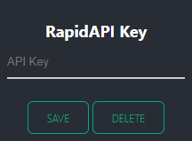
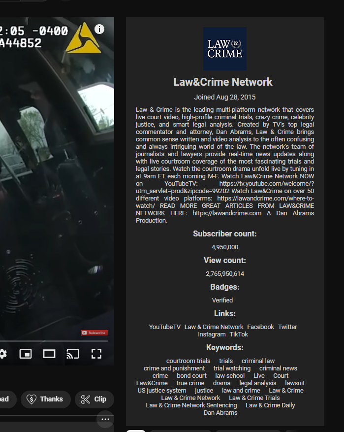

# YouTube Chrome extension

This is a Chrome extension that shows infos about the uploader.

It is based on the [Rapid YouTube API](https://rapidapi.com/Glavier/api/youtube138), react and webpack.

## How to use

1. Clone this repository
2. Install the dependencies with the command `npm install`
3. Build the extension with the command `npm run build`
4. Go to [chrome://extensions/](chrome://extensions/)
5. Enable developer mode
6. Click on "Load unpacked"
7. Select the dist folder of this repository
8. Enter your Rapid API Key in the extension options 
9. Go to [YouTube](https://www.youtube.com/) and click on any video
10. Enjoy!

## Preview

 

